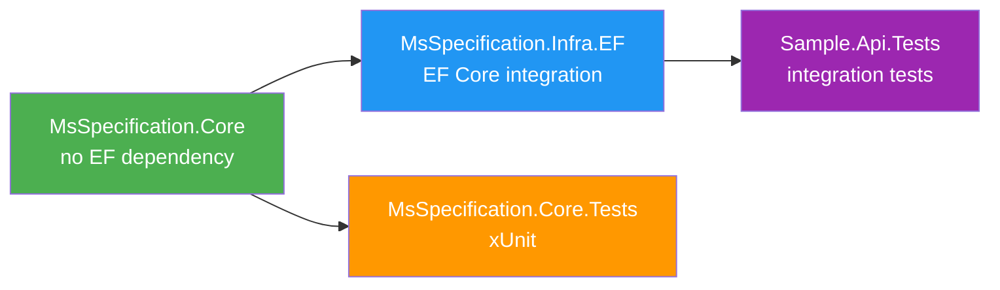

# MsSpecification — Production-Readiness Fix Plan

## Overview

This plan addresses all issues identified in the production-readiness review, organized into 4 phases by priority. Each item includes the exact files to modify, the rationale, and the implementation approach.

---

## Phase 1: Critical API Correctness (Must Fix)

### 1.1 Add `ExecuteUpdateAsync` to `ISpecificationRepository<T>`

**Problem**: [`SpecificationRepository<T>.ExecuteUpdateAsync()`](src/MsSpecification.Infra.EF/SpecificationRepository.cs:99) exists but is not declared on [`ISpecificationRepository<T>`](src/MsSpecification.Core/Contracts/ISpecificationRepository.cs:8). Consumers coding against the interface cannot call it.

**Challenge**: The signature differs between TFMs:
- **net8.0/net9.0**: `Expression<Func<SetPropertyCalls<T>, SetPropertyCalls<T>>>`
- **net10.0**: `Action<UpdateSettersBuilder<T>>`

These types live in `Microsoft.EntityFrameworkCore.Query` — a namespace that the Core project must NOT reference (it has zero EF dependency by design).

**Solution**: Create a new `IUpdateSpecificationRepository<T>` interface in the **Infra.EF** project (where EF types are available), and have `SpecificationRepository<T>` implement both interfaces. This keeps Core clean and follows ISP.

**Files to modify**:

| File | Change |
|---|---|
| `src/MsSpecification.Infra.EF/Contracts/IUpdateSpecificationRepository.cs` | **NEW** — Interface with `ExecuteUpdateAsync` using `#if NET10_0_OR_GREATER` for the TFM-specific signature |
| `src/MsSpecification.Infra.EF/SpecificationRepository.cs` | Add `: IUpdateSpecificationRepository<T>` to class declaration |
| `src/MsSpecification.Infra.EF/Extensions/ServiceCollectionExtensions.cs` | Register `IUpdateSpecificationRepository<>` in DI |
| `src/MsSpecification.Core/Contracts/ISpecificationRepository.cs` | No changes — stays EF-free |
| `README.md` | Update API reference to show `IUpdateSpecificationRepository<T>` for `ExecuteUpdateAsync` |

**New interface design**:

```csharp
// src/MsSpecification.Infra.EF/Contracts/IUpdateSpecificationRepository.cs
namespace MsSpecification.Infra.EF.Contracts;

public interface IUpdateSpecificationRepository<T> where T : class
{
#if NET10_0_OR_GREATER
    Task<int> ExecuteUpdateAsync(
        ISpecification<T> spec,
        Action<Microsoft.EntityFrameworkCore.Query.UpdateSettersBuilder<T>> setPropertyCalls,
        CancellationToken ct = default);
#else
    Task<int> ExecuteUpdateAsync(
        ISpecification<T> spec,
        Expression<Func<Microsoft.EntityFrameworkCore.Query.SetPropertyCalls<T>,
                        Microsoft.EntityFrameworkCore.Query.SetPropertyCalls<T>>> setPropertyCalls,
        CancellationToken ct = default);
#endif
}
```

**Usage pattern change**:

```csharp
// Before (broken — interface doesn't have it):
ISpecificationRepository<Product> repo = ...;
await repo.ExecuteUpdateAsync(spec, s => s.SetProperty(...)); // COMPILE ERROR

// After (works):
IUpdateSpecificationRepository<Product> updateRepo = ...;
await updateRepo.ExecuteUpdateAsync(spec, s => s.SetProperty(...)); // OK
```

---

### 1.2 Implement or Remove `AsStreaming` / `EnableStreaming()`

**Problem**: [`ISpecification<T>.AsStreaming`](src/MsSpecification.Core/Contracts/ISpecification.cs:44) and [`MsSpec<T>.EnableStreaming()`](src/MsSpecification.Core/Contracts/MsSpec.cs:256) are declared but never applied in [`SpecificationEvaluator`](src/MsSpecification.Infra.EF/SpecificationEvaluator.cs:25) or [`SpecificationRepository`](src/MsSpecification.Infra.EF/SpecificationRepository.cs:12). Calling `EnableStreaming()` silently does nothing.

**Solution**: Fully implement streaming. This requires:
1. A new method on the repository that returns `IAsyncEnumerable<T>` (not `Task<List<T>>`)
2. Evaluator support for the `AsStreaming` flag
3. Proper `AsAsyncEnumerable()` call in the query pipeline

**Files to modify**:

| File | Change |
|---|---|
| `src/MsSpecification.Infra.EF/Contracts/IStreamingSpecificationRepository.cs` | **NEW** — Interface with `StreamAsync` returning `IAsyncEnumerable<T>` |
| `src/MsSpecification.Infra.EF/SpecificationRepository.cs` | Implement `IStreamingSpecificationRepository<T>`, add `StreamAsync()` method |
| `src/MsSpecification.Infra.EF/SpecificationEvaluator.cs` | No change needed — `AsAsyncEnumerable()` is called on the final `IQueryable<T>` which already has all spec clauses applied |
| `src/MsSpecification.Infra.EF/Extensions/ServiceCollectionExtensions.cs` | Register `IStreamingSpecificationRepository<>` in DI |
| `README.md` | Update API reference and add streaming usage example |

**New interface design**:

```csharp
// src/MsSpecification.Infra.EF/Contracts/IStreamingSpecificationRepository.cs
namespace MsSpecification.Infra.EF.Contracts;

public interface IStreamingSpecificationRepository<T> where T : class
{
    IAsyncEnumerable<T> StreamAsync(ISpecification<T> spec, CancellationToken ct = default);
    IAsyncEnumerable<TResult> StreamAsync<TResult>(ISpecification<T, TResult> spec, CancellationToken ct = default);
}
```

**Repository implementation**:

```csharp
public IAsyncEnumerable<T> StreamAsync(ISpecification<T> spec, CancellationToken ct = default)
{
    var query = ApplySpecification(spec);
    return query.AsAsyncEnumerable();
}
```

**Note**: The `AsStreaming` flag on the spec is informational — the consumer explicitly chooses `StreamAsync()` vs `ListAsync()`. The flag exists so code can inspect whether a spec was designed for streaming. We should add a runtime check: if `spec.AsStreaming` is true and `ListAsync` is called, log a warning or throw.

---

### 1.3 Remove or Populate `MsSpecification.Contract` Project

**Problem**: [`src/MsSpecification.Contract/`](src/MsSpecification.Contract) has empty `Enums/`, `Interfaces/`, `Models/` folders, no source files, and is not in the solution file. It appears abandoned.

**Solution**: Remove it entirely. The Core project already serves as the contract/abstraction layer. Having a separate empty Contract project adds confusion.

**Files to modify**:

| File | Change |
|---|---|
| `src/MsSpecification.Contract/` | **DELETE** entire directory |
| No other files reference it | No other changes needed |

---

## Phase 2: Important Fixes (Should Fix)

### 2.1 Add Core Unit Tests

**Problem**: All tests are HTTP integration tests. Zero unit tests for Core logic like expression rebinding, include chain building, caching, and `IsSatisfiedBy()`.

**Solution**: Create a `MsSpecification.Core.Tests` project with comprehensive unit tests. Add `InternalsVisibleTo` in Core so test projects can access `internal` types like [`ExpressionNameCache`](src/MsSpecification.Core/Builder/ExpressionNameCache.cs:13) and [`TypeMetadataCache`](src/MsSpecification.Core/Builder/TypeMetadataCache.cs:9).

**Files to create/modify**:

| File | Change |
|---|---|
| `tests/MsSpecification.Core.Tests/MsSpecification.Core.Tests.csproj` | **NEW** — xUnit test project targeting net9.0 |
| `tests/MsSpecification.Core.Tests/SpecificationBuilderTests.cs` | **NEW** — Tests for `Where`, `And`, `Or`, `Not`, `Include`, ordering, pagination, flags |
| `tests/MsSpecification.Core.Tests/CriteriaCompositionTests.cs` | **NEW** — Tests for `CombineExpressions`, parameter rebinding, nested expressions |
| `tests/MsSpecification.Core.Tests/SpecificationExtensionsTests.cs` | **NEW** — Tests for `And()`/`Or()` extension methods, include merging, flag OR-ing |
| `tests/MsSpecification.Core.Tests/IsSatisfiedByTests.cs` | **NEW** — Tests for in-memory evaluation, null criteria, combined specs |
| `tests/MsSpecification.Core.Tests/IncludeChainTests.cs` | **NEW** — Tests for `IncludeChain<T>` add/grow/return, `IncludeChainBuilder` ThenInclude |
| `tests/MsSpecification.Core.Tests/ExpressionNameCacheTests.cs` | **NEW** — Tests for property extraction, filtered include detection |
| `tests/MsSpecification.Core.Tests/TypeMetadataCacheTests.cs` | **NEW** — Tests for collection detection across all supported generic types |
| `src/MsSpecification.Core/MsSpecification.Core.csproj` | Add `<InternalsVisibleTo Include="MsSpecification.Core.Tests" />` |
| `MsSpecification.slnx` | Add test project to solution |

**Test categories and key test cases**:

```
SpecificationBuilderTests
├── Where_SetsCriteria
├── And_WithNoCriteria_SetsAsCriteria
├── And_WithExistingCriteria_CombinesWithAndAlso
├── Or_WithExistingCriteria_CombinesWithOrElse
├── Not_WithNoCriteria_DoesNothing
├── Not_WithExistingCriteria_Negates
├── MultipleAnd_CombinesAll
├── Include_ReferenceNavigation_AddsChain
├── Include_CollectionNavigation_AddsChainWithIsCollection
├── Include_ThenInclude_ChainsCorrectly
├── OrderByAscending_SetsPrimary
├── OrderByDescending_ClearsThenOrderBys
├── Paginate_NegativeSkip_Throws
├── Paginate_ZeroTake_Throws
├── Page_LessThanOne_Throws
├── Page_OneIndexed_CalculatesCorrectSkip

CriteriaCompositionTests
├── And_ParameterRebinding_ProducesCorrectExpression
├── Or_ParameterRebinding_ProducesCorrectExpression
├── NestedAndOr_CombinesCorrectly
├── CombinedWithNot_NegatesEntireExpression

SpecificationExtensionsTests
├── And_MergesIncludes
├── Or_MergesIncludes
├── And_FlagsUseOrLogic_NoTracking
├── And_OrderingUsesLeft
├── And_PaginationUsesLeft
├── And_BothWithRawSql_UsesLeft
├── Or_QueryTag_LeftPreferredOverRight

IsSatisfiedByTests
├── NullCriteria_ReturnsTrue
├── MatchingEntity_ReturnsTrue
├── NonMatchingEntity_ReturnsFalse
├── CombinedSpecAnd_BothMustMatch
├── CombinedSpecOr_EitherCanMatch
├── LazyCompilation_OnlyCompilesOnce

IncludeChainTests
├── AddStep_IncrementsCount
├── Steps_ReturnsCorrectSpan
├── Grow_DoublesCapacity
├── Return_PreventsUseAfterFree
├── ThenInclude_Reference_AddsStep
├── ThenInclude_Collection_AddsStepWithIsCollection

ExpressionNameCacheTests
├── SimpleMember_ReturnsPropertyName
├── FilteredWhere_DetectedAsFiltered
├── FilteredOrderBy_DetectedAsFiltered
├── SimpleMember_NotFiltered
├── ConvertExpression_Unwrapped

TypeMetadataCacheTests
├── String_IsNotCollection
├── List_IsCollection
├── ICollection_IsCollection
├── IEnumerable_IsCollection
├── HashSet_IsCollection
├── IReadOnlyList_IsCollection
├── CustomEnumerable_IsCollection
├── ReferenceType_IsNotCollection
```

---

### 2.2 Fix `CombinedSpecification.IsSatisfiedBy()` Caching

**Problem**: [`CombinedSpecification.IsSatisfiedBy()`](src/MsSpecification.Core/Extensions/SpecificationExtensions.cs:111) calls `Criteria.Compile()` on every invocation, unlike [`MsSpec<T>.IsSatisfiedBy()`](src/MsSpecification.Core/Contracts/MsSpec.cs:92) which uses `Lazy<Func<T, bool>>`.

**Solution**: Add a lazy-compiled delegate field to `CombinedSpecification<T>`.

**Files to modify**:

| File | Change |
|---|---|
| `src/MsSpecification.Core/Extensions/SpecificationExtensions.cs` | Add `Lazy<Func<T, bool>>` field and use it in `IsSatisfiedBy()` |

**Implementation**:

```csharp
internal sealed class CombinedSpecification<T> : ISpecification<T>
{
    private readonly Lazy<Func<T, bool>> _compiledCriteria;

    public CombinedSpecification(ISpecification<T> left, ISpecification<T> right, bool combineWithAnd)
    {
        // ... existing constructor logic ...

        _compiledCriteria = new Lazy<Func<T, bool>>(
            () => Criteria?.Compile() ?? (_ => true),
            LazyThreadSafetyMode.ExecutionAndPublication);
    }

    public bool IsSatisfiedBy(T entity)
    {
        if (Criteria is null) return true;
        return _compiledCriteria.Value(entity);
    }
}
```

---

### 2.3 Guard `IncludeChain<T>.Return()` Against Use-After-Free

**Problem**: [`Return()`](src/MsSpecification.Core/Builder/IncludeChain.cs:58) returns the ArrayPool array but the chain remains accessible via [`Steps`](src/MsSpecification.Core/Builder/IncludeChain.cs:29), leading to corrupted data if accessed after return.

**Solution**: Add a `_returned` flag, set `_steps` to empty, and zero `_count` after returning. Make `Return()` internal and add `ObjectDisposedException`-style guard.

**Files to modify**:

| File | Change |
|---|---|
| `src/MsSpecification.Core/Builder/IncludeChain.cs` | Add `_returned` flag, guard `Steps`/`AddStep`/`Return`, make `Return()` internal |

**Implementation**:

```csharp
public sealed class IncludeChain<T>
{
    private IncludeStep[] _steps;
    private int _count;
    private bool _returned;

    internal IncludeChain(int initialCapacity = 4)
    {
        _steps = ArrayPool<IncludeStep>.Shared.Rent(initialCapacity);
        _count = 0;
        _returned = false;
    }

    public ReadOnlySpan<IncludeStep> Steps
    {
        [MethodImpl(MethodImplOptions.AggressiveInlining)]
        get
        {
            ObjectNotReturned();
            return _steps.AsSpan(0, _count);
        }
    }

    public ref readonly IncludeStep RootStep
    {
        get
        {
            ObjectNotReturned();
            return ref _steps[0];
        }
    }

    internal void AddStep(in IncludeStep step)
    {
        ObjectNotReturned();
        if (_count == _steps.Length)
            Grow();
        _steps[_count++] = step;
    }

    internal void Return()
    {
        if (_returned) return;
        _returned = true;
        ArrayPool<IncludeStep>.Shared.Return(_steps, clearArray: false);
        _steps = Array.Empty<IncludeStep>();
        _count = 0;
    }

    private void ObjectNotReturned()
    {
        if (_returned)
            throw new InvalidOperationException("Cannot access IncludeChain after Return() has been called.");
    }
}
```

---

### 2.4 Complete NuGet Package Metadata

**Problem**: [`Directory.Build.props`](Directory.Build.props) is missing critical NuGet packaging properties: version, repository URL, project URL, icon, SourceLink, symbol packages, and strong-name signing.

**Solution**: Add all missing properties and the SourceLink package reference.

**Files to modify**:

| File | Change |
|---|---|
| `Directory.Build.props` | Add version, repository URL, project URL, SourceLink, symbol package format, continuous integration build, strong-name key |
| `src/MsSpecification.Core/MsSpecification.Core.csproj` | Add SourceLink package reference |
| `src/MsSpecification.Infra.EF/MsSpecification.Infra.EF.csproj` | Add SourceLink package reference |
| `docs/logo.png` | **NEW** — Package icon (128x128 PNG) |
| `README.md` | Embed as package readme |

**Updated `Directory.Build.props`**:

```xml
<Project>
  <PropertyGroup>
    <TargetFrameworks>net8.0;net9.0;net10.0</TargetFrameworks>
    <ImplicitUsings>enable</ImplicitUsings>
    <Nullable>enable</Nullable>
    <LangVersion>latest</LangVersion>
    <TreatWarningsAsErrors>true</TreatWarningsAsErrors>
    <GenerateDocumentationFile>true</GenerateDocumentationFile>
    <NoWarn>$(NoWarn);CS1591</NoWarn>

    <!-- Versioning -->
    <VersionPrefix>1.0.0</VersionPrefix>
    <VersionSuffix></VersionSuffix>

    <!-- NuGet package metadata -->
    <Authors>MS</Authors>
    <Description>High-performance Specification Pattern implementation for .NET and Entity Framework Core</Description>
    <PackageLicenseExpression>MIT</PackageLicenseExpression>
    <PackageTags>specification-pattern;ef-core;entity-framework;repository;cqrs;query</PackageTags>
    <RepositoryType>git</RepositoryType>
    <RepositoryUrl>https://github.com/MohamedSayed/MsSpecification</RepositoryUrl>
    <PackageProjectUrl>https://github.com/MohamedSayed/MsSpecification</PackageProjectUrl>
    <PackageIcon>logo.png</PackageIcon>
    <PackageReadmeFile>README.md</PackageReadmeFile>

    <!-- SourceLink & Symbols -->
    <PublishRepositoryUrl>true</PublishRepositoryUrl>
    <EmbedUntrackedSources>true</EmbedUntrackedSources>
    <IncludeSymbols>true</IncludeSymbols>
    <SymbolPackageFormat>snupkg</SymbolPackageFormat>

    <!-- Strong-name signing -->
    <SignAssembly>true</SignAssembly>
    <AssemblyOriginatorKeyFile>$(MSBuildThisFileDirectory)MsSpecification.snk</AssemblyOriginatorKeyFile>

    <!-- CI build detection -->
    <ContinuousIntegrationBuild Condition="'$(GITHUB_ACTIONS)' == 'true'">true</ContinuousIntegrationBuild>
  </PropertyGroup>

  <ItemGroup>
    <PackageReference Include="Microsoft.SourceLink.GitHub" Version="8.0.0" PrivateAssets="All" />
  </ItemGroup>
</Project>
```

**Note**: The `.snk` file needs to be generated:

```bash
sn -k MsSpecification.snk
```

---

### 2.5 Set Up CI/CD Pipeline

**Problem**: No build automation exists.

**Solution**: Create a GitHub Actions workflow that builds, tests, packs, and publishes.

**Files to create**:

| File | Change |
|---|---|
| `.github/workflows/build.yml` | **NEW** — CI build on push/PR |
| `.github/workflows/publish.yml` | **NEW** — Publish to NuGet on release |
| `.editorconfig` | **NEW** — Consistent code style |

**`build.yml` design**:

```yaml
name: Build & Test
on:
  push:
    branches: [main]
  pull_request:
    branches: [main]

jobs:
  build:
    strategy:
      matrix:
        os: [ubuntu-latest, windows-latest]
        tfm: [net8.0, net9.0, net10.0]
    runs-on: ${{ matrix.os }}
    steps:
      - uses: actions/checkout@v4
      - uses: actions/setup-dotnet@v4
        with:
          dotnet-version: |
            8.0.x
            9.0.x
            10.0.x
      - run: dotnet build -c Release
      - run: dotnet test -c Release --framework ${{ matrix.tfm }} --logger "trx"
      - run: dotnet pack -c Release --output artifacts

  benchmarks:
    runs-on: windows-latest
    needs: build
    steps:
      - uses: actions/checkout@v4
      - run: cd benchmarks/MsSpecification.Benchmarks && dotnet run -c Release
```

**`publish.yml` design**:

```yaml
name: Publish to NuGet
on:
  release:
    types: [published]

jobs:
  publish:
    runs-on: ubuntu-latest
    steps:
      - uses: actions/checkout@v4
      - run: dotnet pack -c Release -p:Version=${{ github.event.release.tag_name }}
      - uses: actions/upload-artifact@v4
        with:
          path: artifacts/*.nupkg
      - run: dotnet nuget push artifacts/*.nupkg -k ${{ secrets.NUGET_API_KEY }} -s https://api.nuget.org/v3/index.json
```

---

## Phase 3: Minor Improvements (Nice to Fix)

### 3.1 Fix `BuildNavigationPath` Intermediate Allocation

**Problem**: [`SpecificationEvaluator.BuildNavigationPath()`](src/MsSpecification.Infra.EF/SpecificationEvaluator.cs:141) calls `steps.ToArray()` to convert `ReadOnlySpan<IncludeStep>` for `string.Create`, allocating on every non-filtered multi-step include.

**Solution**: Use a `ValueStringBuilder` or manual `Span<char>` + `string.Concat` approach.

**Files to modify**:

| File | Change |
|---|---|
| `src/MsSpecification.Infra.EF/SpecificationEvaluator.cs` | Rewrite `BuildNavigationPath` to avoid `ToArray()` |

**Implementation**:

```csharp
private static string BuildNavigationPath(ReadOnlySpan<IncludeStep> steps)
{
    if (steps.Length == 1)
        return steps[0].PropertyName;

    // Calculate total length
    var totalLength = steps.Length - 1; // dots
    for (int i = 0; i < steps.Length; i++)
        totalLength += steps[i].PropertyName.Length;

    return string.Create(totalLength, steps, static (span, stepsArr) =>
    {
        var pos = 0;
        for (int i = 0; i < stepsArr.Length; i++)
        {
            if (i > 0) span[pos++] = '.';
            var name = stepsArr[i].PropertyName;
            name.AsSpan().CopyTo(span[pos..]);
            pos += name.Length;
        }
    });
}
```

Wait — the issue is that `string.Create`'s `TState` parameter gets boxed when it's a `ReadOnlySpan<IncludeStep>`. The current code already uses `steps.ToArray()`. A better approach: since typical chains are 1-3 steps, use `stackalloc` for the property names:

```csharp
private static string BuildNavigationPath(ReadOnlySpan<IncludeStep> steps)
{
    if (steps.Length == 1)
        return steps[0].PropertyName;

    // For short chains (typical: 1-3 steps), build directly
    var totalLength = steps.Length - 1;
    for (int i = 0; i < steps.Length; i++)
        totalLength += steps[i].PropertyName.Length;

    Span<char> buffer = totalLength <= 256 ? stackalloc char[totalLength] : new char[totalLength];

    var pos = 0;
    for (int i = 0; i < steps.Length; i++)
    {
        if (i > 0) buffer[pos++] = '.';
        var name = steps[i].PropertyName.AsSpan();
        name.CopyTo(buffer[pos..]);
        pos += name.Length;
    }

    return new string(buffer);
}
```

---

### 3.2 Add `.editorconfig` and Roslyn Analyzers

**Files to create/modify**:

| File | Change |
|---|---|
| `.editorconfig` | **NEW** — C# coding conventions |
| `Directory.Build.props` | Add `Microsoft.CodeAnalysis.NetAnalyzers` package reference |

**`.editorconfig` key sections**:

```ini
root = true

[*.cs]
indent_style = space
indent_size = 4
csharp_style_var_for_built_in_types = false:suggestion
csharp_style_var_when_type_is_apparent = true:suggestion
csharp_style_var_elsewhere = false:suggestion
csharp_style_expression_bodied_methods = when_on_single_line:suggestion
csharp_style_expression_bodied_properties = true:suggestion
dotnet_naming_rule.interface_should_begin_with_i.severity = warning
dotnet_naming_rule.interface_should_begin_with_i.symbols = interface
dotnet_naming_rule.interface_should_begin_with_i.prefix = I
dotnet_style_require_accessibility_modifiers = always:suggestion
dotnet_style_readonly_field = true:suggestion
```

---

### 3.3 Add `CHANGELOG.md` and `CONTRIBUTING.md`

**Files to create**:

| File | Change |
|---|---|
| `CHANGELOG.md` | **NEW** — Follow Keep a Changelog format |
| `CONTRIBUTING.md` | **NEW** — PR process, coding standards, test requirements |

---

### 3.4 Re-evaluate `CountAsync<TResult>` Semantics

**Problem**: [`ISpecificationRepository<T>.CountAsync<TResult>`](src/MsSpecification.Core/Contracts/ISpecificationRepository.cs:35) counts projected results, which is semantically unusual and generates suboptimal SQL.

**Solution**: Mark it `[Obsolete]` in the next minor version with a message pointing to `CountAsync(ISpecification<T>)` for criteria-only counting. Remove in the next major version.

**Files to modify**:

| File | Change |
|---|---|
| `src/MsSpecification.Core/Contracts/ISpecificationRepository.cs` | Add `[Obsolete]` to `CountAsync<TResult>` |
| `src/MsSpecification.Infra.EF/SpecificationRepository.cs` | Add `[Obsolete]` to implementation |

---

### 3.5 Add SQL Server Test Variant

**Problem**: Sample API only uses SQLite, which doesn't exercise all EF Core SQL generation paths.

**Solution**: Add a SQL Server integration test project or use `UseInMemoryDatabase` for additional coverage. This is lower priority since the library generates `IQueryable<T>` and relies on EF Core's SQL generation, not its own.

---

## Phase 4: Documentation Updates

### 4.1 Update README.md

**Files to modify**:

| File | Change |
|---|---|
| `README.md` | Update API reference, add streaming section, update `ExecuteUpdateAsync` docs, add `IUpdateSpecificationRepository` and `IStreamingSpecificationRepository` |

**Key changes**:
- Add `IUpdateSpecificationRepository<T>` section to API Reference
- Add `IStreamingSpecificationRepository<T>` section with `StreamAsync` usage example
- Update `ISpecificationRepository<T>` table to remove `ExecuteUpdateAsync` (moved to new interface)
- Add versioning/badge section at top (NuGet version, build status)

---

## Dependency Flow After Changes



---

## New File Structure After All Changes

```
MsSpecification/
├── .editorconfig                              # NEW
├── .github/
│   └── workflows/
│       ├── build.yml                          # NEW
│       └── publish.yml                        # NEW
├── CHANGELOG.md                               # NEW
├── CONTRIBUTING.md                            # NEW
├── Directory.Build.props                      # MODIFIED
├── MsSpecification.snk                        # NEW
├── docs/
│   └── logo.png                               # NEW
├── src/
│   ├── MsSpecification.Core/
│   │   ├── Contracts/
│   │   │   ├── ISpecification.cs              # No change
│   │   │   ├── ISpecificationRepository.cs    # No change (ExecuteUpdateAsync stays off this)
│   │   │   └── MsSpec.cs                      # No change
│   │   ├── Builder/
│   │   │   ├── ExpressionNameCache.cs         # No change
│   │   │   ├── IncludeChain.cs                # MODIFIED — Return() guard
│   │   │   ├── IncludeChainBuilder.cs         # No change
│   │   │   └── TypeMetadataCache.cs           # No change
│   │   ├── Extensions/
│   │   │   └── SpecificationExtensions.cs     # MODIFIED — IsSatisfiedBy caching
│   │   └── MsSpecification.Core.csproj        # MODIFIED — InternalsVisibleTo
│   ├── MsSpecification.Contract/              # DELETED
│   └── MsSpecification.Infra.EF/
│       ├── Contracts/
│       │   ├── IUpdateSpecificationRepository.cs   # NEW
│       │   └── IStreamingSpecificationRepository.cs # NEW
│       ├── SpecificationEvaluator.cs          # MODIFIED — BuildNavigationPath fix
│       ├── SpecificationRepository.cs         # MODIFIED — implements new interfaces
│       ├── FilteredIncludeApplier.cs          # No change
│       ├── Extensions/
│       │   ├── QueryableExtensions.cs         # No change
│       │   └── ServiceCollectionExtensions.cs # MODIFIED — register new interfaces
│       └── MsSpecification.Infra.EF.csproj    # MODIFIED — SourceLink
├── tests/
│   └── MsSpecification.Core.Tests/            # NEW
│       ├── MsSpecification.Core.Tests.csproj
│       ├── SpecificationBuilderTests.cs
│       ├── CriteriaCompositionTests.cs
│       ├── SpecificationExtensionsTests.cs
│       ├── IsSatisfiedByTests.cs
│       ├── IncludeChainTests.cs
│       ├── ExpressionNameCacheTests.cs
│       └── TypeMetadataCacheTests.cs
├── samples/                                   # No change
├── benchmarks/                                # No change
└── README.md                                  # MODIFIED
```

---

## Implementation Order

The items should be implemented in this exact order to avoid merge conflicts and ensure each step builds cleanly:

1. **Delete `MsSpecification.Contract`** — simplest, no dependencies
2. **Guard `IncludeChain<T>.Return()`** — small, self-contained
3. **Fix `CombinedSpecification.IsSatisfiedBy()` caching** — small, self-contained
4. **Add `IUpdateSpecificationRepository<T>`** — new interface + repository changes + DI registration
5. **Add `IStreamingSpecificationRepository<T>`** — new interface + repository changes + DI registration
6. **Fix `BuildNavigationPath` allocation** — small, in SpecificationEvaluator
7. **Add `InternalsVisibleTo` to Core csproj** — prerequisite for tests
8. **Create `MsSpecification.Core.Tests` project** — all unit tests
9. **Update `Directory.Build.props`** — NuGet metadata, SourceLink, signing
10. **Generate `.snk` file** — for strong-name signing
11. **Add `.editorconfig`** — code style consistency
12. **Add `CHANGELOG.md` + `CONTRIBUTING.md`** — documentation
13. **Add `docs/logo.png`** — package icon
14. **Update `README.md`** — reflect all API changes
15. **Add CI/CD workflows** — GitHub Actions
16. **Mark `CountAsync<TResult>` obsolete** — minor API cleanup
17. **Update `MsSpecification.slnx`** — add new projects, remove deleted ones
